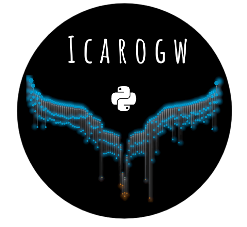

Special thanks LIGO-Virgo-KAGRA / Aaron Geller / Northwestern who made possible the cool logo with the masses in the [Stellar graveyard](https://media.ligo.northwestern.edu/gallery/mass-plot)

[](https://zenodo.org/badge/latestdoi/615814860)

# icarogw 

## Installation

You will need a `python 3.12` environment created with conda. 

Then, simply run

```
pip install git+https://github.com/icarogw-developers/icarogw.git
```

or your favourite branch/tag with

```
pip install git+https://github.com/simone-mastrogiovanni/icarogw.git@tag
```

### Installing the GPU CUDA version

To use the GPU/CUDA version you need to install cupy. After your installation is complete, just run

```
conda install -c conda-forge cupy==12.0
```

## Some details

When you are using icarogw2.0, you can put inside your working folder a file called `config.py` containing

```latex
CUPY=False
```

if you do not want to use the GPU. IF you want to use the GPU, remember to use cupy instead of numpy

## Example and Notebooks

There is also a Zenodo data distribution where you can download [example tutorials](https://zenodo.org/record/7846415#.ZG0BetJBxQo).

